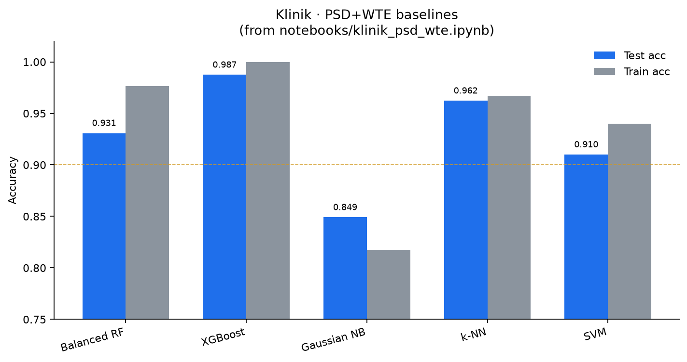
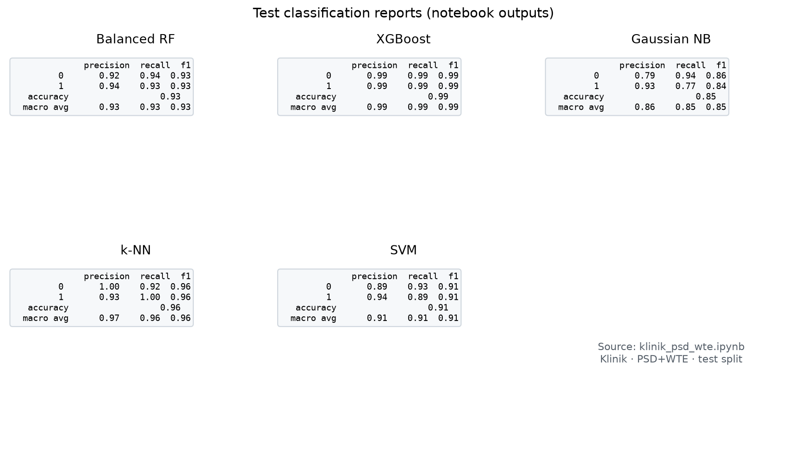

# EEG Baseline Models

Classical DSP + ML baselines for EEG classification. Companion to [eeg-self-supervised-embedding](https://github.com/ErfanMohammdpour/eeg-self-supervised-embedding).

**Status:** ongoing · reproducible baselines first · subject-wise protocol next

## Results (Klinik · PSD + WTE)

From `notebooks/klinik_psd_wte.ipynb`  
Setup: `KlinikDataset`, features `PSD + WTE` → flatten (2814-d), stratified `train_test_split` 80/20



| Model | Test acc | Test F1 (macro) | Train acc |
|-------|----------|-----------------|-----------|
| XGBoost | **0.987** | **0.987** | 1.000 |
| k-NN | 0.962 | 0.962 | 0.967 |
| Balanced RF (`max_depth=4`) | 0.931 | 0.931 | 0.976 |
| SVM (ovo) | 0.910 | 0.910 | 0.940 |
| Gaussian NB | 0.849 | 0.848 | 0.818 |



**Caveat:** single random split, not patient/group LOSO. Numbers = feature/model reference, not clinical claim.

Detail: [`results/klinik_psd_wte.md`](results/klinik_psd_wte.md)

## Stack

- **Features:** PSD (Welch), WTE, WPTE, CSP loader
- **Models:** SVM, Balanced RF, XGBoost, Gaussian NB, k-NN
- **Loaders:** Klinik, BCI IV-2a, LEE, CHB-MIT, synthetic, CSP features

## Setup

```bash
git clone https://github.com/ErfanMohammdpour/eeg-baseline-models.git
cd eeg-baseline-models
python -m venv .venv && source .venv/bin/activate
pip install -r requirements.txt
export PYTHONPATH=.
```

## Quick start

```bash
python scripts/run_experiment.py \
  --config configs/experiments/baseline.json \
  --dataset KlinikDataset \
  --data-path /path/to/klinik \
  --channels configs/eeg_recording_standard/international_10_20_21.py
```

Or open `notebooks/klinik_psd_wte.ipynb`.

## Layout

```
configs/           # electrode maps + experiment JSON
baseline/
  data/            # dataset loaders
  features/        # DSP transforms
  training/        # split / fit / metrics
  config_io/
scripts/
notebooks/
docs/figs/         # notebook-derived figures
results/
```
