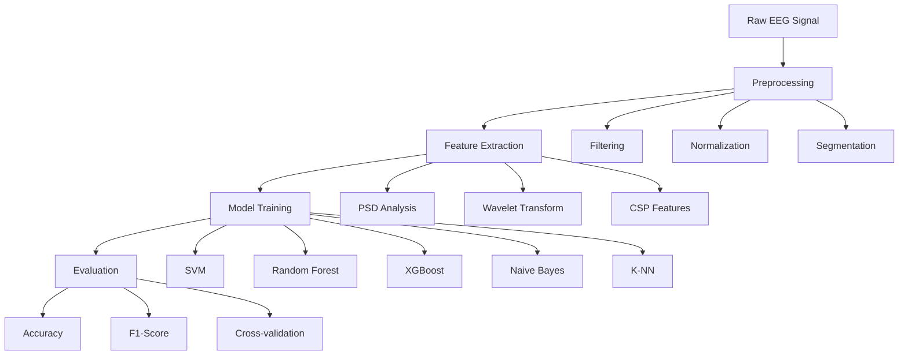

# 🧠 Baseline Models for EEG Analysis

<div align="center">


*A comprehensive framework for EEG signal analysis and classification using classical machine learning approaches*

[](https://opensource.org/licenses/MIT)
[](https://www.python.org/downloads/)
[](https://pytorch.org/)

</div>

## 📋 Table of Contents

- [Overview](#-overview)
- [Key Features](#-key-features)
- [Supported Datasets](#-supported-datasets)
- [Implemented Methods](#-implemented-methods)
- [Installation](#-installation)
- [Quick Start](#-quick-start)
- [Project Structure](#-project-structure)
- [Performance Baselines](#-performance-baselines)
- [Contributing](#-contributing)
- [Citation](#-citation)

## 🧠 Overview

This repository implements a **modular and extensible framework** for EEG (electroencephalography) signal analysis, supporting multiple datasets and classical machine learning approaches. Designed to establish **baseline performance metrics** for various EEG classification tasks including:

- 🧠 **Epilepsy Detection** - Seizure identification and monitoring
- 🎯 **Motor Imagery Classification** - Brain-computer interface applications  
- 🔬 **Clinical EEG Analysis** - Medical diagnosis and treatment support
- 📊 **Signal Processing** - Advanced feature extraction techniques

## ✨ Key Features

<div align="center">

| Feature | Description | Status |
|---------|-------------|--------|
| 🗃️ **Multiple Datasets** | CHB-MIT, BCI Competition 2a, LEE, Klinik, Synthetic | ✅ |
| 🤖 **ML Models** | SVM, Random Forest, XGBoost, Naive Bayes, K-NN | ✅ |
| 📊 **Signal Processing** | PSD, Wavelet Transform, Common Spatial Patterns | ✅ |
| 🏗️ **Modular Architecture** | Configurable pipelines & extensible design | ✅ |
| 📈 **Experiment Tracking** | Weights & Biases integration | ✅ |
| 🔄 **Cross-validation** | Patient-wise splits & multiple strategies | ✅ |
| 🧠 **EEG Standards** | International 10-20 electrode configurations | ✅ |

</div>

## 📊 Supported Datasets

<div align="center">

| Dataset | Task | Classes | Sampling Rate | Description |
|---------|------|---------|---------------|-------------|
| 🏥 **CHB-MIT** | Epilepsy Detection | 2 | Variable | Scalp EEG database for seizure detection |
| 🎯 **BCI 2a** | Motor Imagery | 4 | 250 Hz → 256 Hz | Left/right hand, feet, tongue motor imagery |
| 🧠 **LEE** | Motor Imagery | 2 | 1000 Hz → 256 Hz | Left vs right hand motor imagery |
| 🔬 **Klinik** | Clinical Classification | 2 | Variable | Clinical EEG with balanced sampling |
| 🧪 **Synthetic** | Testing | 2 | 256 Hz | Generated data for algorithm validation |

</div>

## 🔄 EEG Analysis Pipeline



## 🛠️ Implemented Methods

### Feature Extraction
- **Power Spectral Density (PSD)**: Frequency domain analysis using Welch's method
- **Wavelet Transform Energy (WTE)**: Time-frequency decomposition
- **Wavelet Packet Transform Energy (WPTE)**: Detailed wavelet analysis
- **Common Spatial Patterns (CSP)**: Spatial filtering for motor imagery

### Classification Models
- Support Vector Machine (SVM) with one-vs-one strategy
- Balanced Random Forest Classifier
- XGBoost with binary/multiclass objectives
- Gaussian Naive Bayes
- K-Nearest Neighbors (K-NN)

## 📋 Requirements

- Python 3.8+
- NumPy
- SciPy
- scikit-learn
- PyTorch
- MNE-Python
- XGBoost
- PyWavelets
- Weights & Biases (optional)

## 🚀 Installation

### Prerequisites
- Python 3.8 or higher
- CUDA-capable GPU (recommended for faster processing)

### Quick Setup

```bash
# 1. Clone the repository
git clone https://github.com/yourusername/baseline_models_eeg.git
cd baseline_models_eeg

# 2. Create virtual environment
python -m venv venv
source venv/bin/activate  # On Windows: venv\Scripts\activate

# 3. Install dependencies
pip install -r requirements.txt
```

### Alternative Installation (Conda)

```bash
# Create conda environment
conda create -n eeg-analysis python=3.8
conda activate eeg-analysis

# Install PyTorch (adjust for your CUDA version)
conda install pytorch torchvision torchaudio pytorch-cuda=11.8 -c pytorch -c nvidia

# Install other dependencies
pip install -r requirements.txt
```

## 🚀 Quick Start

### 1. Basic EEG Classification

```python
from baseline.data.bci import bci_dataset
from baseline.utils.transforms import *
from baseline.configs.utils import get_classifier

# Load BCI dataset with preprocessing
dataset = bci_dataset.BCIDataset(
    data_path="/path/to/bci/data",
    train=True,
    transform=Compose([
        PSD(),           # Power Spectral Density
        Flatten(),       # Flatten features
        Normalize()      # Normalize data
    ])
)

# Initialize SVM classifier
clf = get_classifier("svm", multiclass=True)

# Train and evaluate
X_train, y_train = dataset.get_all_data()
clf.fit(X_train, y_train)

# Make predictions
predictions = clf.predict(X_test)
```

### 2. Running Pre-configured Experiments

```bash
# Run baseline experiment on BCI dataset
python scripts/run_experiment.py --config baseline/configs/run_configs/baseline_bci.json

# Run CSP-based experiment
python scripts/run_experiment.py --config baseline/configs/run_configs/baseline_csp.json
```

### 3. Custom Configuration

```json
{
    "dataset": "bci",
    "model": "svm",
    "features": ["psd", "wte"],
    "validation": "stratified_kfold",
    "n_splits": 5,
    "random_state": 42
}
```

## 📊 Performance Baselines

<div align="center">

| Dataset | Model | Accuracy | F1-Score | Notes |
|---------|-------|----------|----------|-------|
| 🎯 **BCI 2a** | SVM + CSP | **70-75%** | **0.68-0.73** | Motor imagery classification |
| 🏥 **CHB-MIT** | Random Forest + PSD | **85-90%** | **0.83-0.88** | Epilepsy detection |
| 🧠 **LEE** | XGBoost + WTE | **78-82%** | **0.76-0.80** | Hand movement classification |
| 🔬 **Klinik** | SVM + PSD | **80-85%** | **0.78-0.83** | Clinical EEG analysis |

*Performance may vary based on preprocessing and hyperparameter tuning*

</div>

## 🏗️ Project Structure

```
baseline_models_eeg/
├── 📁 baseline/                    # Core framework
│   ├── 📁 configs/                 # Configuration files
│   │   ├── 📁 eeg_recording_standard/  # Electrode configurations
│   │   ├── 📁 run_configs/        # Experiment configurations
│   │   └── 📁 utils/              # Configuration utilities
│   ├── 📁 data/                   # Dataset implementations
│   │   ├── 📁 bci/                # BCI Competition 2a dataset
│   │   ├── 📁 chb_mit/            # CHB-MIT epilepsy dataset
│   │   ├── 📁 csp_feature/        # CSP feature loader
│   │   ├── 📁 Klinik/             # Clinical EEG dataset
│   │   ├── 📁 LEE/                # LEE motor imagery dataset
│   │   └── 📁 synthetic/           # Synthetic data generator
│   └── 📁 utils/                  # Utility functions
│       ├── 📄 transforms.py       # Signal processing transforms
│       └── 📄 utils.py            # General utilities
├── 📁 notebooks/                  # Jupyter notebooks
│   └── 📄 baseline.ipynb          # Example notebook
├── 📁 scripts/                    # Command-line scripts
│   └── 📄 classic_var_feature_size.py  # Feature analysis
├── 📄 requirements.txt            # Dependencies
└── 📄 README.md                   # This file
```

## 🔧 Customization

### Adding a New Dataset

```python
from baseline.data.base import BaseDataset

class MyDataset(BaseDataset):
    def __init__(self, data_path, train=True, transform=None):
        super().__init__(data_path, train, transform)
        # Load your data here
    
    def __getitem__(self, idx):
        # Return (eeg_signal, label)
        pass
```

### Adding a New Transform

```python
class MyTransform:
    def __call__(self, x):
        # Process EEG signal x
        return transformed_x
```

## 🎯 Use Cases

<div align="center">

| Application | Description | Dataset | Performance |
|-------------|-------------|---------|-------------|
| 🏥 **Medical Diagnosis** | Epilepsy detection and monitoring | CHB-MIT | 85-90% accuracy |
| 🎮 **Brain-Computer Interface** | Motor imagery classification | BCI 2a | 70-75% accuracy |
| 🔬 **Clinical Research** | EEG signal analysis | Klinik | 80-85% accuracy |
| 🧪 **Algorithm Development** | Testing new methods | Synthetic | Baseline metrics |

</div>

## 🤝 Contributing

We welcome contributions from the community! Here's how you can help:

### 🐛 Bug Reports
- Use GitHub Issues to report bugs
- Include detailed reproduction steps
- Provide system information and error logs

### 💡 Feature Requests
- Suggest new datasets or models
- Propose improvements to existing features
- Discuss potential enhancements

### 🔧 Code Contributions
1. Fork the repository
2. Create a feature branch (`git checkout -b feature/amazing-feature`)
3. Commit your changes (`git commit -m 'Add amazing feature'`)
4. Push to the branch (`git push origin feature/amazing-feature`)
5. Open a Pull Request

## 📄 License

This project is licensed under the MIT License - see the [LICENSE](LICENSE) file for details.

## 📚 Citation

If you use this framework in your research, please cite:

```bibtex
@software{baseline_models_eeg,
  author = {Your Name},
  title = {Baseline Models for EEG Analysis},
  url = {https://github.com/yourusername/baseline_models_eeg},
  year = {2024}
}
```

## 🙏 Acknowledgments

- CHB-MIT dataset providers
- BCI Competition organizers  
- MNE-Python developers
- scikit-learn contributors
- PyTorch team
